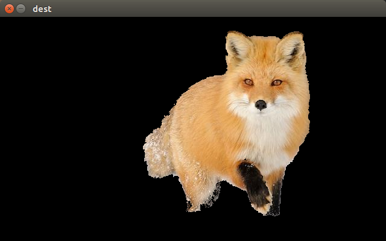

# grab_cut
A demo shows how to use "grab cut" algorithm in C++ and Opencv2. It is revised from a [python version](https://www.jianshu.com/p/117f66320589), and I add a mouse-callback function for drawing bounding box easily.

## Environment
* GCC
* CMake
* Opencv 2

## Files
* opencv_demo.cpp: A demo shows how to use "grab cut" algorithm in C++ and Opencv2+.

## Effect
* source image

* give bounding box

* result

## TODO
 * reimplement "grab cut" algorithm in pure C++
 * is possible to segment multi objects?

 ## Attention
 You need to change "OpenCV_DIR", "OpenCV_LIB_DIR", "OpenCV_INCLUDE_DIRS" in "CMakeList.txt".

